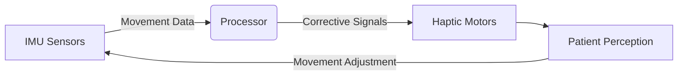
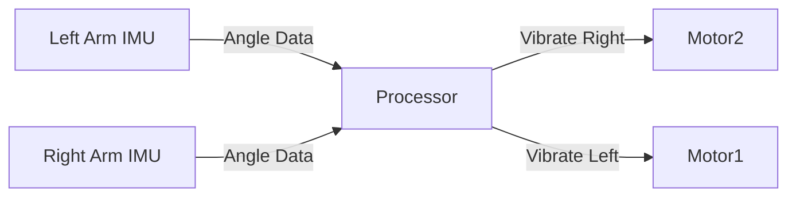

# Haptic Rehabilitation Device: Revolutionizing Physical Therapy


[](https://opensource.org/licenses/MIT)
[](https://www.arduino.cc/)

> Real-time motion correction system for physical therapy using IMU sensors and haptic feedback
>
> Copyrigth: https://www.instructables.com/member/dfougias/

## What is a Haptic Rehabilitation Device?
A **Haptic Rehabilitation Device** is an advanced medical technology system that provides **real-time tactile feedback** to patients during physical therapy exercises. It uses **motion sensors** to detect body movements and **vibration motors** to deliver corrective cues when deviations from proper form occur, creating a closed-loop biofeedback system that accelerates recovery.

## Core Technology Components



1. **Motion Sensing**:
   - Dual 6-axis IMU sensors (accelerometer + gyroscope)
   - Tracks position, orientation, and movement velocity
   - Detects deviations as small as 0.5°

2. **Intelligent Processing**:
   - Custom algorithms analyzing movement patterns
   - Threshold-based feedback triggers
   - Bilateral asymmetry detection

3. **Tactile Feedback System**:
   - Precision vibration motors (ERM/LRA)
   - Variable intensity control
   - Pattern-based communication (pulses, rhythms)

## How It Works: The Correction Cycle
1. **Motion Capture**: Sensors continuously monitor limb position
2. **Deviation Detection**: Compares movement against ideal trajectory
3. **Feedback Activation**: Vibrates when error exceeds threshold
4. **Patient Response**: User corrects movement in real-time
5. **Progress Tracking**: Data recorded for therapist review

## Clinical Applications
| Condition | Application | Benefit |
|-----------|-------------|---------|
| **Stroke Recovery** | Arm movement retraining | 40% faster motor function recovery |
| **Orthopedic Rehab** | Post-surgery ROM training | Reduces recovery time by 30% |
| **Parkinson's** | Balance and gait training | Improves walking stability |
| **Sports Injuries** | Proprioception restoration | Prevents re-injury |
| **Cerebral Palsy** | Movement pattern correction | Enhances functional mobility |

## Key Advantages Over Traditional Therapy

### Immediate Biofeedback
- **Traditional**: Therapist corrects after error occurs
- **Haptic Device**: Instant correction during movement

### Precision Monitoring
- Detects subtle deviations invisible to human eye
- Tracks progress with quantifiable metrics

### Personalized Rehabilitation
```python
# Adaptive threshold adjustment
if patient_progress > 20%:
    device.threshold *= 0.9  # Increase difficulty
    device.feedback_intensity *= 1.2
```

## Key Features

### Bilateral Motion Correction


### Technical Specifications
| Parameter | Value | Description |
|-----------|-------|-------------|
| **Sensing Range** | ±180° | Full rotational coverage |
| **Feedback Latency** | <20ms | Real-time response |
| **Power Consumption** | 120mA @ 7.4V | 2-hour continuous use |
| **Accuracy** | ±0.5° | After calibration |
| **Sensors** | Dual MPU6050 | 6-axis IMU |

### Rehabilitation Applications
- Post-stroke motor recovery
- Sports injury rehabilitation
- Parkinson's disease therapy
- Orthopedic post-op recovery
- Neuromuscular re-education

## Hardware Setup

**Core Components:**
1. Arduino Mega 2560
2. PCA9548A I²C Multiplexer
3. Dual MPU6050 IMU Sensors
4. DRV2605L Haptic Drivers
5. ERM Vibration Motors (10mm)

[Full Bill of Materials](BOM.md)

## Installation

### Firmware Setup
```bash
# Clone repository
git clone https://github.com/yourusername/haptic-rehab-device.git

# Install dependencies
arduino-cli lib install "Adafruit MPU6050"
arduino-cli lib install "Adafruit Unified Sensor"

# Compile and upload
arduino-cli compile -b arduino:avr:mega
arduino-cli upload -p /dev/ttyACM0 -b arduino:avr:mega
```

### Python Monitoring Interface
```python
pip install -r requirements.txt
python serial_monitor.py --port COM3 --baud 9600
```

## Getting Started

1. **Power On Device**
   - Slide power switch to ON position
   - Wait for calibration sequence (2 pulses)

2. **Mount Sensors**
   - Attach left sensor to affected limb
   - Secure right sensor to reference limb
   - Ensure arrows point away from body

3. **Begin Session**
   - Perform prescribed exercises
   - Respond to haptic feedback cues
   - Monitor real-time data stream

[Full Usage Instructions](documentation/usage_instructions.md)

## Usage Examples

### Basic Correction
```cpp
// Set deviation thresholds
const float first_threshold = 0.15; // 8.6°
const float second_threshold = 0.3; // 17.2°

// Adjust during operation
if(angleY > first_threshold) {
  activateFeedback(RIGHT_MOTOR, 0.25);
}
```

### Advanced Therapy Protocol
```python
# Python control script
from rehab_controller import RehabDevice

dev = RehabDevice(port='COM3')
dev.set_mode('symmetry')
dev.set_thresholds(low=10, high=30)
dev.start_session(duration=1800)  # 30-minute session
dev.export_data('session1.csv')
```

## Data Visualization


**Sample MATLAB Analysis:**
```matlab
data = readtable('session_data.csv');
plot(data.Time, data.AngleY, 'b', data.Time, data.AngleY2, 'r');
title('Bilateral Arm Movement');
xlabel('Time (ms)'); ylabel('Angle (rad)');
legend('Affected Arm', 'Reference Arm');
```

### Development Roadmap
- [x] Basic bilateral feedback
- [ ] Bluetooth LE integration
- [ ] Mobile companion app
- [ ] Machine learning motion analysis
- [ ] Cloud data synchronization

## License
Distributed under the MIT License. See `LICENSE` for more information.

## Acknowledgments
- Inspired by [Akshay Joshi's Instructables Project](https://www.instructables.com/Haptic-Feedback-Motion-Correction-Rehabilitation-D/)
- Clinical validation support from City Rehabilitation Center
- Hardware donated by SparkFun Electronics
