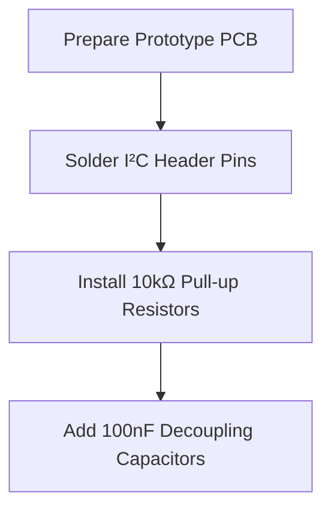
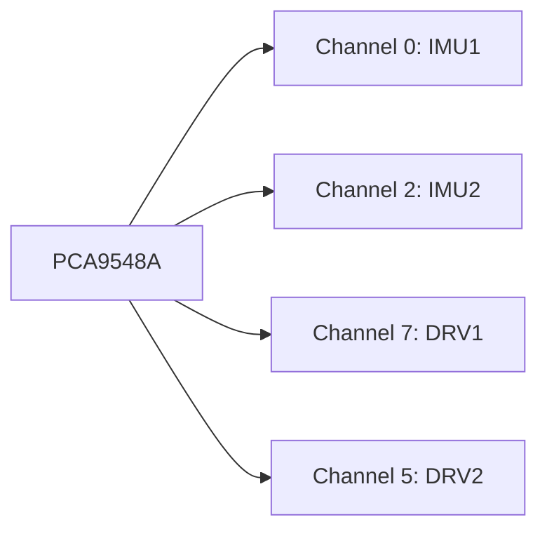
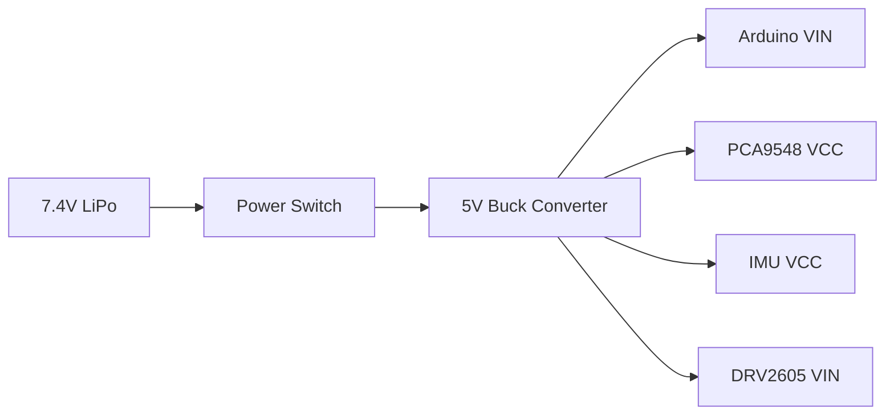

# Step-by-Step Assembly Instructions

## Tools Required
- Soldering iron (25-40W)
- Wire strippers/cutters
- Multimeter
- Phillips screwdriver
- 3D printer (for enclosure)

## 1. PCB Preparation


**Steps:**
1. Solder 4-pin headers for each I²C connection point (MPU6050, DRV2605, PCA9548)
2. Install pull-up resistors:
   - 10kΩ between SDA and 5V
   - 10kΩ between SCL and 5V
3. Place 100nF capacitors:
   - Between VCC and GND near each IC
   - At Arduino 5V input

## 2. I²C Multiplexer Setup


**Wiring:**
| PCA9548 Pin | Arduino Mega | Connection Type |
|-------------|--------------|-----------------|
| VCC         | 5V           | Direct          |
| GND         | GND          | Direct          |
| SDA         | SDA (20)     | Direct          |
| SCL         | SCL (21)     | Direct          |
| A0-A2       | GND          | Jumper wire     |

## 3. IMU Sensor Installation
```markdown
### Left Arm Sensor (IMU1 - Channel 0)
1. Connect to PCA9548 Channel 0:
   - SDA → PCA9548 Ch0 SDA
   - SCL → PCA9548 Ch0 SCL
   - VCC → PCA9548 Ch0 VCC
   - GND → PCA9548 Ch0 GND

2. Mounting orientation:
   - Arrow mark facing upward
   - Double-sided foam tape for vibration isolation

### Right Arm Sensor (IMU2 - Channel 2)
1. Connect to PCA9548 Channel 2:
   - Same pinout as IMU1
   - Ensure separate channel from IMU1

2. Calibration position:
   - Place both IMUs flat during calibration
```

## 4. Haptic Driver Setup
```markdown
### Left Driver (DRV1 - Channel 7)
| DRV2605 Pin | Connection             | Note                  |
|-------------|------------------------|-----------------------|
| VIN         | Buck Converter 5V      | NOT Arduino 5V        |
| GND         | Common Ground          |                       |
| SDA         | PCA9548 Ch7 SDA        |                       |
| SCL         | PCA9548 Ch7 SCL        |                       |
| OUT+        | Motor1 Positive        | Polarity sensitive    |
| OUT-        | Motor1 Negative        |                       |

### Right Driver (DRV2 - Channel 5)
Same connections as DRV1 but using PCA9548 Channel 5

### Motor Wiring:
- Use 24 AWG silicone wires
- Heat shrink all connections
- Secure wires with cable ties
```

## 5. Arduino Connections
```markdown
| Arduino Pin | Component       | Function              |
|-------------|-----------------|-----------------------|
| 20 (SDA)    | PCA9548 SDA     | I²C Data              |
| 21 (SCL)    | PCA9548 SCL     | I²C Clock             |
| 7           | Button          | Calibration trigger   |
| 6 (OC4D)    | DRV1 Enable     | PWM Output            |
| 13 (OC4A)   | DRV2 Enable     | PWM Output            |
| VIN         | Buck Converter  | 7-12V Input           |
| GND         | Common Ground   | Star topology         |
```

## 6. Power System Assembly


**Safety Precautions:**
1. Add 1A fuse on battery positive lead
2. Install reverse polarity protection diode
3. Verify voltages:
   - Buck output: 5.0±0.2V
   - DRV2605 VIN: 4.8-5.2V

## 7. Enclosure Assembly
```markdown
### 3D Printed Parts (Print Settings: 0.2mm layer, PETG)
1. Main enclosure (150×80×40mm)
2. Wrist mount (left/right versions)
3. Motor holders (10mm diameter)
4. Button cover

### Assembly Sequence:
1. Secure Arduino with M3 screws
2. Mount PCB using 10mm standoffs
3. Snap-fit vibration motors into holders
4. Glue IMU sensors to mounting pads
5. Install clear acrylic cover with magnets
```

## 8. Final Integration
```markdown
1. Insert LiPo battery in dedicated compartment
2. Route all wires through cable channels
3. Apply strain relief to all wire exits
4. Verify no pinched wires before closing

### Initial Test Procedure:
1. Power on device - green LED should blink
2. Press calibration button - motors vibrate briefly
3. Rotate device - verify serial output shows angles
4. Tilt left arm - right motor should vibrate
```

## Troubleshooting Checklist
| Symptom                  | Likely Cause               | Solution                  |
|--------------------------|----------------------------|---------------------------|
| No power                 | Battery not connected      | Check XT60 connector      |
| IMU not detected         | I²C channel mismatch       | Verify PCA9548 addressing |
| Motors not vibrating     | DRV2605 not initialized    | Check ModeReg 0x03 write  |
| Angle drift              | Poor calibration           | Re-run calibration cycle  |
| Erratic vibrations       | PWM frequency conflict     | Verify TCCR4B = PWM12k    |

## Calibration Procedure
1. Place device on flat surface
2. Press and hold button for 3 seconds
3. Wait until both motors pulse twice
4. Do not move device during calibration (takes 2 seconds per IMU)
