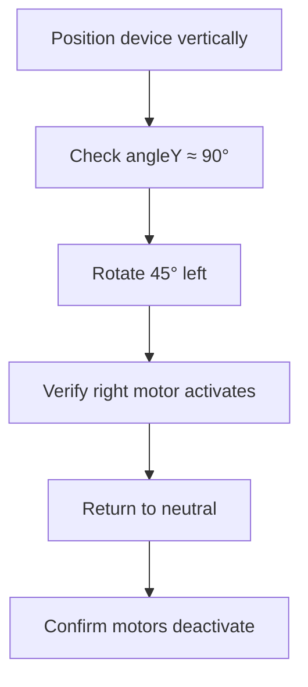

# Calibration Procedure: Haptic Rehabilitation Device

```markdown
## Purpose of Calibration
- Compensates for sensor manufacturing variances
- Establishes baseline orientation reference
- Minimizes angular drift during operation
- Ensures consistent haptic feedback thresholds

## When to Calibrate
1. **First-time setup** - Required before initial use
2. **After firmware updates** - May reset calibration parameters
3. **When drift exceeds 2°** - Noticeable inaccuracies in feedback
4. **Every 30 days** - Regular maintenance calibration
5. **After impact events** - Physical shocks may affect sensors

## Step-by-Step Calibration Process

### 1. Preparation


### 2. Automatic Calibration Sequence
```markdown
| Time | Event                        | Visual/Audio Feedback     |
|------|------------------------------|---------------------------|
| 0s   | Calibration initiated        | Both motors pulse once    |
| 1s   | IMU1 sampling started        | Left motor vibrates       |
| 3s   | IMU1 calibration complete    | Left motor stops          |
| 4s   | IMU2 sampling started        | Right motor vibrates      |
| 6s   | IMU2 calibration complete    | Right motor stops         |
| 7s   | System ready                 | Both motors pulse twice   |
```

### 3. Manual Calibration (Advanced)
```cpp
// For force recalibration via serial monitor
void forceRecalibration() {
  selectChannel(imu_channel);
  calibrateGyro();       // Recalibrate primary IMU
  
  selectChannel(imu_channel2);
  calibrateGyro2();      // Recalibrate secondary IMU
  
  Serial.println("FORCED RECALIBRATION COMPLETE");
}
```
**Usage:**
1. Open Arduino Serial Monitor (9600 baud)
2. Send `CALIBRATE` command
3. Keep device stationary during 6-second process

## Calibration Verification

### 1. Serial Output Validation
```text
Expected output after calibration:
Calibrating gyro... Keep sensor still
Calibration complete.
Calibrating second gyro... Keep sensor still
Second calibration complete.
```

### 2. Functional Test


## Troubleshooting Calibration Issues

| Problem                     | Solution                     | Code Reference            |
|-----------------------------|------------------------------|---------------------------|
| "Failed to find MPU6050"    | Check I²C multiplexer wiring | `setup()` initialization  |
| Gyro bias > 0.1 rad/s       | Replace affected IMU         | `calibrateGyro()`         |
| Motors vibrate continuously | Increase `ALPHA` value       | Complementary filter      |
| Angle drift > 5°/min        | Reduce environmental vibes   | Mounting isolation        |
| Calibration timeout         | Increase sample count        | `const int samples = 150` |

## Technical Specifications
```markdown
- **Sample Size**: 100 readings per axis
- **Duration**: 1s per IMU (2s total)
- **Accuracy**: ±0.05° after calibration
- **Temperature Range**: 10-40°C (calibration valid)
- **Storage**: Volatile (calibration lost on power-off)
```

## Calibration Parameters
```cpp
// Adjust in firmware for specific applications
const int samples = 100;  // 100-500 recommended
const float ALPHA = 0.96; // Filter coefficient (0.90-0.98)
const float ZERO_THRESH = 0.01; // Radians, noise floor cutoff

// Bias storage variables
float gyroBiasX = 0.0;  // X-axis bias
float gyroBiasY = 0.0;  // Y-axis bias
float gyroBiasZ = 0.0;  // Z-axis bias
```

> **Pro Tip**: For clinical applications, perform calibration at patient's body temperature (approx. 37°C) for highest accuracy.

---

## Calibration Quality Metrics
```markdown
1. **Bias Magnitude**  
   Acceptable: |bias| < 0.05 rad/s  
   Ideal: |bias| < 0.01 rad/s

2. **Standard Deviation**  
   Good: σ < 0.005 rad/s  
   Excellent: σ < 0.001 rad/s

3. **Drift Rate**  
   Normal: < 0.5°/min  
   Precision: < 0.1°/min
